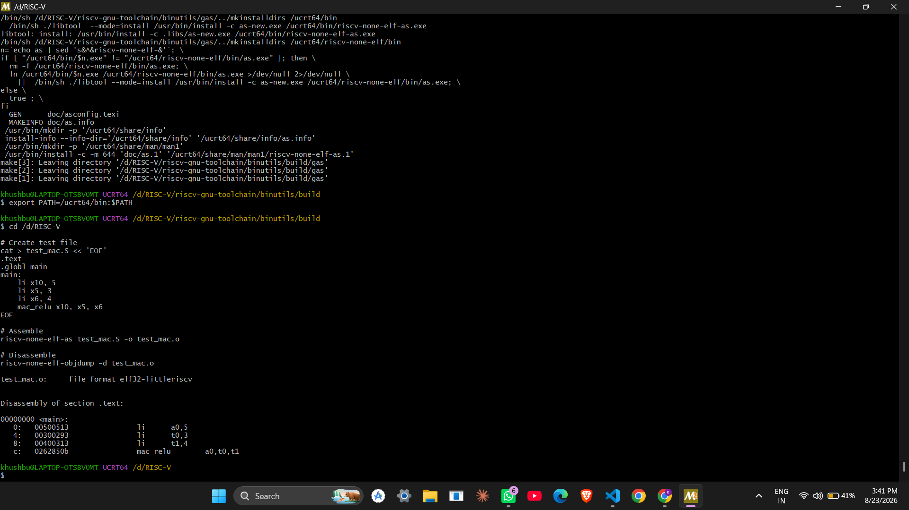
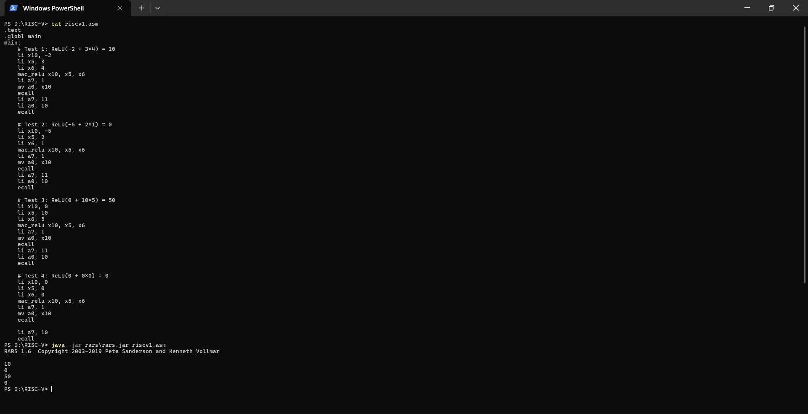

# Custom RISC-V Instruction (Design → Toolchain → Execution)

A custom RISC-V instruction, **`mac_relu`** (Multiply-Accumulate with ReLU), designed from scratch, integrated into the GNU Binutils toolchain (assembler + disassembler), and given real execution semantics inside the RARS simulator - verified end-to-end on Windows via MSYS2.

```
mac_relu rd, rs1, rs2
rd = ReLU(rd + rs1 × rs2)      where ReLU(x) = max(0, x)
```


*Custom assembler installed, test program assembled, and `mac_relu` correctly disassembled by the modified `objdump`.*


*The same instruction, now executing inside a modified RARS simulator - four test cases, output matching hand-calculated values exactly.*

---

## Table of Contents
1. [Overview](#overview)
2. [What Was Achieved](#what-was-achieved)
3. [Instruction Design](#instruction-design)
4. [Part 1 — Toolchain Integration (GNU Binutils)](#part-1--toolchain-integration-gnu-binutils)
5. [Part 2 — Execution (RARS Simulator)](#part-2--execution-rars-simulator)
6. [Verification](#verification)
7. [Common Pitfalls](#common-pitfalls)
8. [File Structure](#file-structure)
9. [What This Does and Doesn't Prove](#what-this-does-and-doesnt-prove)
10. [Next Steps](#next-steps)

---

## Overview

Most "custom instruction" tutorials stop at teaching an assembler a new mnemonic - which proves the encoding is well-formed, but proves nothing about whether the instruction actually *does* anything. This project goes one step further and closes the full loop:

**Design → Encode (GNU Binutils) → Decode (GNU objdump) → Assemble natively (RARS) → Execute (patched RARS)**

Everything was done on Windows using MSYS2 - no WSL, no hardware, no FPGA. That's a deliberate scope choice, not a shortcut: WSL had previously caused hash-mismatch/corruption issues on this machine, and hardware implementation was explicitly out of scope for this project.

## Motivation

Neural network workloads spend most of their time on a small set of repeated operations: matrix multiplications, dot products, activations, and quantization. Beyond the arithmetic itself, a CPU also spends real time loading data, storing data, moving data between registers, and executing each step separately. For ML workloads, this data movement is often more expensive than the math. `mac_relu` explores whether one of these ML-relevant patterns (a multiply-accumulate immediately followed by a Rectified Linear Unit (ReLU) clamp) is common and self-contained enough to justify folding into a single instruction, using RISC-V's custom-0 opcode space rather than the two-to-three separate standard instructions it would otherwise take.

---

## What Was Achieved

- Designed a custom RISC-V instruction and calculated its 32-bit encoding
- Modified GNU Binutils (`riscv-opc.c`, `riscv-opc.h`) so the assembler and disassembler recognize `mac_relu` as a real mnemonic
- Built a custom `riscv-none-elf-as` and `riscv-none-elf-objdump` from source using MSYS2
- Verified the assembler and disassembler round-trip correctly (`mac_relu x10,x5,x6` ⇄ `0x0262850B`)
- Modified the RARS simulator's own source to recognize `mac_relu` **natively** and to actually execute it
- Rebuilt `rars.jar` from source
- Ran a 4-case test program using **plain `mac_relu` syntax**, with results matching independent hand-calculations exactly

---

## Instruction Design

| Field   | Value                | Bits    |
|---------|----------------------|---------|
| funct7  | `0000001`            | [31:25] |
| rs2     | register             | [24:20] |
| rs1     | register             | [19:15] |
| funct3  | `000`                | [14:12] |
| rd      | register             | [11:7]  |
| opcode  | `0001011` (custom-0) | [6:0]   |

`0001011` is one of RISC-V's officially reserved **custom-0** opcode slots - set aside by the spec specifically for non-standard extensions, so this doesn't collide with any real instruction.

**Example encoding:**
```
mac_relu x10, x5, x6  →  0x0262850B
```

---

## Part 1 — Toolchain Integration (GNU Binutils)

This teaches the **assembler and disassembler** to recognize the mnemonic and correctly encode/decode it. It does *not* make anything execute - an assembler only maps text ↔ bits.

### Environment Setup

```bash
# Install MSYS2 from https://www.msys2.org/, then in MSYS2 UCRT64:
pacman -Syu
pacman -S --needed base-devel mingw-w64-ucrt-x86_64-toolchain
pacman -S git texinfo

cd /d/RISC-V
git clone https://github.com/riscv-collab/riscv-gnu-toolchain.git
cd riscv-gnu-toolchain
git submodule update --init --recursive
```

### Modify `riscv-opc.c`

Add to the `riscv_opcodes[]` array:
```c
{"mac_relu", 0, INSN_CLASS_I, "d,s,t", MATCH_MAC_RELU, MASK_MAC_RELU, match_opcode, 0},
```

### Modify `riscv-opc.h`

```c
#define MATCH_MAC_RELU 0x0200000b
#define MASK_MAC_RELU  0xfe00707f
```

### Build

```bash
cd /d/RISC-V/riscv-gnu-toolchain/binutils
rm -rf build && mkdir build && cd build

/d/RISC-V/riscv-gnu-toolchain/binutils/configure \
    --target=riscv-none-elf \
    --disable-nls --disable-gdb --disable-werror --disable-doc

make -j$(nproc) all-opcodes MAKEINFO=true
make -j$(nproc) all-binutils MAKEINFO=true

cp gas/as-new.exe /ucrt64/bin/riscv-none-elf-as.exe
make install MAKEINFO=true
export PATH=/ucrt64/bin:$PATH
```

### Verify

```bash
riscv-none-elf-as --version
riscv-none-elf-objdump --version
```

### Test - Assemble & Disassemble

```bash
cd /d/RISC-V
cat > test_mac.S << 'EOF'
.text
.globl main
main:
    li x10, 5
    li x5, 3
    li x6, 4
    mac_relu x10, x5, x6
EOF

riscv-none-elf-as test_mac.S -o test_mac.o
riscv-none-elf-objdump -d test_mac.o
```

**Output:**
```
00000000 <main>:
   0:   00500513            li      a0,5
   4:   00300293            li      t0,3
   8:   00400313            li      t1,4
   c:   0262850b            mac_relu a0,t0,t1
```

This confirms the encode/decode round-trip works - but at this point `mac_relu` is still just a *name* for a bit pattern. Nothing runs it yet.

---

## Part 2 — Execution (RARS Simulator)

No simulator automatically knows what a custom opcode should *do*. RARS is a fixed Java simulator implementing standard RV32IM - it has zero built-in knowledge of `mac_relu`. Making the instruction actually compute something required editing RARS's own source.

RARS was chosen over Spike/WSL for this step: it's a single `.jar`, pure Java build, no Linux dependency, and no virtualization layer to fight with.

### How RARS Loads Instructions

RARS auto-discovers instructions at startup by scanning `rars/riscv/instructions/` for any class extending `BasicInstruction`. No manual registry file needs editing - one correctly-written `.java` file is enough. Each such class supplies both the parsing template (mnemonic + 32-bit mask, using `f`/`s`/`t` for `rd`/`rs1`/`rs2`) and a `simulate()` method for execution, confirmed by reading RARS's real source (`MUL.java`, `Arithmetic.java`, `BasicInstruction.java`).

### Corrected Implementation

`rars/src/rars/riscv/instructions/MAC_RELU.java`:

```java
package rars.riscv.instructions;

import rars.ProgramStatement;
import rars.riscv.BasicInstruction;
import rars.riscv.BasicInstructionFormat;
import rars.riscv.hardware.RegisterFile;

/**
 * Custom instruction: mac_relu rd, rs1, rs2
 * Operation: rd = max(0, rd + rs1 * rs2)
 *
 * Encoding (R-type, custom-0 opcode space):
 *   funct7 = 0000001   [31:25]
 *   rs2               [24:20]
 *   rs1               [19:15]
 *   funct3 = 000       [14:12]
 *   rd                [11:7]
 *   opcode = 0001011   [6:0]   (custom-0)
 */
public class MAC_RELU extends BasicInstruction {
    public MAC_RELU() {
        super("mac_relu t1,t2,t3",
                "Multiply-Accumulate with ReLU: set t1 to max(0, t1 + t2*t3)",
                BasicInstructionFormat.R_FORMAT,
                "0000001 ttttt sssss 000 fffff 0001011");
    }

    public void simulate(ProgramStatement statement) {
        int[] operands = statement.getOperands();
        int rdVal = RegisterFile.getValue(operands[0]);
        // We read rdVal first because the instruction must accumulate: rd_new = ReLU(rd_old + rs1 * rs2)
        int rs1Val = RegisterFile.getValue(operands[1]);
        int rs2Val = RegisterFile.getValue(operands[2]);

        int result = rdVal + rs1Val * rs2Val;
        if (result < 0) {
            result = 0;
        }
        RegisterFile.updateRegister(operands[0], result);
    }
}
```

Unlike `MUL` (which only needs `rs1`/`rs2`), `mac_relu` needs `rd`'s **existing** value too, since it accumulates into it - read explicitly before the register is overwritten.

### Build

```bash
cd /d/RISC-V
git clone https://github.com/TheThirdOne/rars.git
cd rars
git submodule update --init --recursive
# place MAC_RELU.java at src/rars/riscv/instructions/MAC_RELU.java
./build-jar.sh
```

```bash
export PATH="/c/Program Files/Java/jdk-22/bin:$PATH"
```

### Test

```asm
.text
.globl main
main:
    # Test 1: ReLU(-2 + 3×4) = 10
    li x10, -2
    li x5, 3
    li x6, 4
    mac_relu x10, x5, x6
    li a7, 1
    mv a0, x10
    ecall
    li a7, 11
    li a0, 10
    ecall

    # Test 2: ReLU(-5 + 2×1) = 0
    li x10, -5
    li x5, 2
    li x6, 1
    mac_relu x10, x5, x6
    li a7, 1
    mv a0, x10
    ecall
    li a7, 11
    li a0, 10
    ecall

    # Test 3: ReLU(0 + 10×5) = 50
    li x10, 0
    li x5, 10
    li x6, 5
    mac_relu x10, x5, x6
    li a7, 1
    mv a0, x10
    ecall
    li a7, 11
    li a0, 10
    ecall

    # Test 4: ReLU(0 + 0×0) = 0
    li x10, 0
    li x5, 0
    li x6, 0
    mac_relu x10, x5, x6
    li a7, 1
    mv a0, x10
    ecall

    li a7, 10
    ecall
```

```bash
java -jar rars\rars.jar riscv1.asm
```

**Output:**
```
RARS 1.6  Copyright 2003-2019 Pete Sanderson and Kenneth Vollmar

10
0
50
0
```

Note this uses the **plain `mac_relu` mnemonic** - RARS's own internal assembler now understands it natively, no `.4byte` raw hex workaround needed.

---

## Verification

| Test | rd (before) | rs1 | rs2 | rd + rs1×rs2 | ReLU(x) | RARS Output |
|------|-------------|-----|-----|--------------|---------|-------------|
| 1    | -2          | 3   | 4   | -2 + 12 = 10 | 10      | **10**    |
| 2    | -5          | 2   | 1   | -5 + 2 = -3  | 0       | **0**     |
| 3    | 0           | 10  | 5   | 0 + 50 = 50  | 50      | **50**    |
| 4    | 0           | 0   | 0   | 0 + 0 = 0    | 0       | **0**     |

All four outputs match independently hand-calculated expected values exactly, across register values chosen specifically to exercise both the ReLU clamp (tests 2 and 4) and normal positive accumulation (tests 1 and 3).

---

## Common Pitfalls

| Issue | Cause | Fix |
|-------|-------|-----|
| `bad RISC-V opcode (mask error)` | `MATCH_*` has wrong bit position | Verify `MATCH` = (funct7 << 25) \| (funct3 << 12) \| opcode |
| `makeinfo: command not found` | Missing texinfo | `pacman -S texinfo` |
| `objdump: No such file` | Built only `all-gas`, not `all-binutils` | Run `make all-binutils` |
| `.word` error in RARS `.S` files | RARS restricts `.word` in `.text` | Use `.4byte` instead |
| `riscv-none-elf-as: command not found` | PATH not set | `export PATH=/ucrt64/bin:$PATH` |
| `jar: command not found` in `build-jar.sh` | PATH pointed to a JRE, not a JDK | `export PATH="/c/Program Files/Java/jdk-22/bin:$PATH"` |
| RARS `Arithmetic` subclass silently wrong opcode | `Arithmetic` hardcodes standard opcode `0110011` | Extend `BasicInstruction` directly for custom opcodes |

---

## File Structure

## Repository Structure

```text
riscv-custom-mac-relu-instruction/
│
├── README.md
├── docs
├── patches/
│   ├── riscv-opc.c
│   └── riscv-opc.h
│
├── rars-src/
│   └── modified RARS source code
│
├── rars.jar
│
└── tests/
    ├── test_mac.S
    ├── test_dot.S
    └── riscv1.asm
```
### Actual project layout, as developed:
``` text
D:\RISC-V\
├── docs\
│   └── README.md         # motivation, instruction syntax, step-by-step roadmap
├── rars\                          # cloned RARS source + rebuilt simulator
│   ├── src\rars\riscv\instructions\
│   │   └── MAC_RELU.java          # custom execution semantics (modified)
│   └── rars.jar                   # rebuilt jar with mac_relu support
├── riscv-gnu-toolchain\           # cloned GNU toolchain
│   └── binutils\
│       ├── opcodes\riscv-opc.c        (modified — assembler recognition)
│       └── include\opcode\riscv-opc.h (modified — MATCH/MASK defines)
├── riscv-opcodes\                 # cloned riscv-opcodes reference (opcode space definitions)
├── toolchain\                     # xPack prebuilt toolchain (reference/fallback)
├── build\                         # build artifacts
├── riscv1.asm                     # RARS execution test (native mac_relu mnemonic, 4 cases)
├── test_mac.S / test_mac.o        # Binutils encode/decode test
└── test_dot.S / .o                # dot_prod instruction test (Binutils only, not yet in RARS)
```
---

## What This Does and Doesn't Prove

**Proven, with reproducible evidence:**
- The encoding is a valid, non-conflicting use of RISC-V's reserved custom-0 opcode space
- GNU Binutils correctly assembles and disassembles the instruction
- A real fetch-decode-execute loop (RARS) correctly computes `max(0, rd + rs1×rs2)` across multiple register value combinations

**Not claimed:**
- No hardware/RTL/FPGA implementation - this is a software-simulator-level result, which was the explicit scope given for this project
- No integration with Spike or GCC - RARS and GNU Binutils were the two tools targeted here
- The instruction is not part of any official RISC-V extension - it's a custom, non-standard opcode for coursework/demonstration purposes

Being explicit about scope like this is a strength, not a weakness - it shows the difference between "recognized by an assembler" and "actually executes" is understood, which is the core technical insight of the whole project.

---

## Next Steps

- Add more instructions (`dot_prod`, `mac_relu_8` quantized variant, `max_pool`)
- Extend to Spike for a terminal-native, industry-standard reference simulator
- Explore GCC intrinsics so `mac_relu` could be emitted from C code
- Hardware: Verilog/VHDL implementation and FPGA testing
