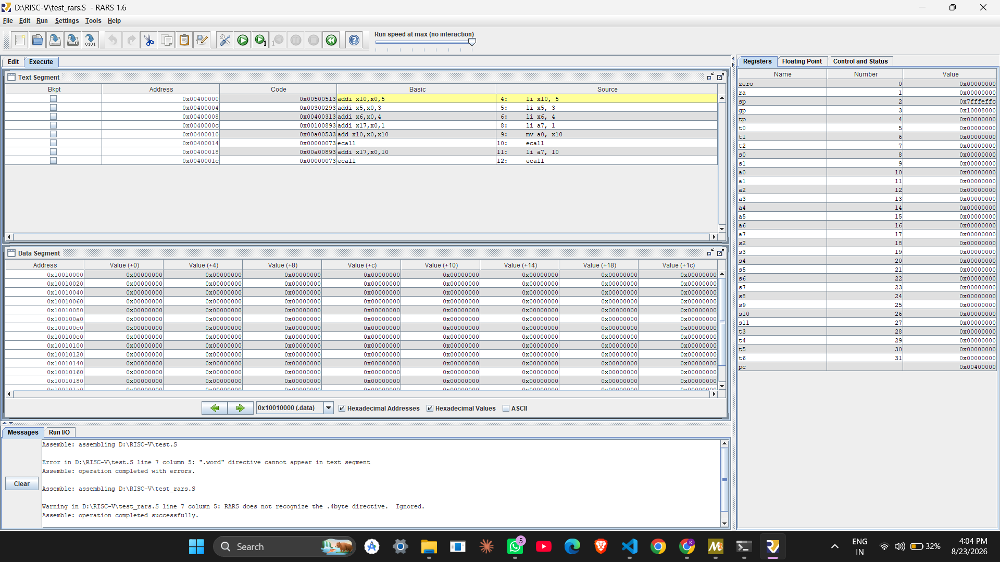

# Custom RISC-V Instruction Implementation

Implementation of a custom RISC-V instruction called **`mac_relu`** (Multiply-Accumulate with ReLU), including toolchain modification, custom assembler/disassembler builds, and verification in the RARS simulator.

This report documents the end-to-end implementation of a custom RISC-V instruction (`mac_relu`) on a Windows system. The project involves designing the instruction, modifying the GNU Binutils toolchain to recognize it, building custom assembler and disassembler tools, and verifying execution using the RARS simulator. All steps are captured with working commands and verification screenshots.


*Custom assembler installed, `test_mac.S` assembled, and `mac_relu` correctly disassembled by the modified `objdump`.*

---

## Table of Contents
1. [Project Overview](#project-overview)
2. [Environment Setup](#environment-setup)
3. [Instruction Design](#instruction-design)
4. [Toolchain Modification](#toolchain-modification)
5. [Building Custom Tools](#building-custom-tools)
6. [Testing and Verification](#testing-and-verification)
7. [Creating a New Custom Instruction](#creating-a-new-custom-instruction)
8. [Summary of Working Commands](#summary-of-working-commands)
9. [Key Takeaways](#key-takeaways)
10. [File Structure](#file-structure)
11. [Next Steps](#next-steps)
12. [Notes](#notes)

---

## Project Overview

This project designs and implements a custom RISC-V instruction, calculates its binary encoding, modifies GNU Binutils (assembler and disassembler), builds the custom tools on Windows via MSYS2, and verifies execution in the RARS simulator.

**What was achieved:**
- Designed a custom RISC-V instruction
- Calculated its binary encoding
- Modified GNU Binutils (assembler and disassembler)
- Built custom tools on Windows using MSYS2
- Verified execution in the RARS simulator

---

## Environment Setup

### 1. Install MSYS2
- Download from: https://www.msys2.org/
- Install with default settings
- Open **MSYS2 UCRT64** from the Start menu

### 2. Install Required Packages

```bash
# Update package database
pacman -Syu
# Close and reopen MSYS2 UCRT64, then run:
pacman -Syu

# Install build tools
pacman -S --needed base-devel mingw-w64-ucrt-x86_64-toolchain

# Install git and texinfo
pacman -S git texinfo
```

### 3. Clone the RISC-V Toolchain

```bash
cd /d/RISC-V
git clone https://github.com/riscv-collab/riscv-gnu-toolchain.git
cd riscv-gnu-toolchain
git submodule update --init --recursive
```

---

## Instruction Design

### `mac_relu` Instruction

```
Format: mac_relu rd, rs1, rs2
Operation: rd = ReLU(rd + rs1 × rs2)
Where ReLU(x) = max(0, x)
```

### Encoding

| Field   | Value                | Bits    |
|---------|----------------------|---------|
| funct7  | `0000001`            | [31:25] |
| rs2     | register             | [24:20] |
| rs1     | register             | [19:15] |
| funct3  | `000`                | [14:12] |
| rd      | register             | [11:7]  |
| opcode  | `0001011` (custom-0) | [6:0]   |

**Example Encoding:**
```
mac_relu x10, x5, x6
→ 0x0262850B
```

---

## Toolchain Modification

### Step 1: Modify `riscv-opc.c`

```bash
nano /d/RISC-V/riscv-gnu-toolchain/binutils/opcodes/riscv-opc.c
```

Add this line in the `riscv_opcodes[]` array (after `{"pause", ...}` and before `{"unimp", ...}`):

```c
{"mac_relu", 0, INSN_CLASS_I, "d,s,t", MATCH_MAC_RELU, MASK_MAC_RELU, match_opcode, 0},
```

### Step 2: Modify `riscv-opc.h`

```bash
nano /d/RISC-V/riscv-gnu-toolchain/binutils/include/opcode/riscv-opc.h
```

Add these defines near other `MATCH_*` definitions:

```c
#define MATCH_MAC_RELU 0x0200000b
#define MASK_MAC_RELU  0xfe00707f
```

### Step 3: Verify Modifications

```bash
grep -A 2 "mac_relu" /d/RISC-V/riscv-gnu-toolchain/binutils/opcodes/riscv-opc.c
grep "MATCH_MAC_RELU" /d/RISC-V/riscv-gnu-toolchain/binutils/include/opcode/riscv-opc.h
```

**Expected output:**
```
{"mac_relu", 0, INSN_CLASS_I, "d,s,t", MATCH_MAC_RELU, MASK_MAC_RELU, match_opcode, 0},
/* Basic RVI instructions and aliases.  */
#define MATCH_MAC_RELU 0x0200000b
```

---

## Building Custom Tools

### Step 1: Create a Symlink (to avoid spaces in path)

```bash
cd /d
ln -s "RISC V" RISC-V
```

### Step 2: Build Modified Binutils

```bash
cd /d/RISC-V/riscv-gnu-toolchain/binutils
rm -rf build
mkdir build
cd build

# Configure
/d/RISC-V/riscv-gnu-toolchain/binutils/configure \
    --target=riscv-none-elf \
    --disable-nls \
    --disable-gdb \
    --disable-werror \
    --disable-doc

# Build
make -j$(nproc) all-opcodes MAKEINFO=true
make -j$(nproc) all-binutils MAKEINFO=true
```

### Step 3: Install Custom Tools

```bash
# Copy the custom assembler
cp /d/RISC-V/riscv-gnu-toolchain/binutils/build/gas/as-new.exe /ucrt64/bin/riscv-none-elf-as.exe

# Install binutils
cd /d/RISC-V/riscv-gnu-toolchain/binutils/build
make install MAKEINFO=true
```

### Step 4: Add to PATH

```bash
export PATH=/ucrt64/bin:$PATH
```

### Step 5: Verify Installation

```bash
riscv-none-elf-as --version
riscv-none-elf-objdump --version
```

---

## Testing and Verification

### Step 1: Create Test Program

```bash
cd /d/RISC-V

cat > test_mac.S << 'EOF'
.text
.globl main
main:
    li x10, 5
    li x5, 3
    li x6, 4
    mac_relu x10, x5, x6
EOF
```

### Step 2: Assemble with Custom Assembler

```bash
riscv-none-elf-as test_mac.S -o test_mac.o
```

### Step 3: Disassemble with Custom Objdump

```bash
riscv-none-elf-objdump -d test_mac.o
```

**Expected Output:**
```
test_mac.o:     file format elf32-littleriscv

Disassembly of section .text:

00000000 <main>:
   0:   00500513            li      a0,5
   4:   00300293            li      t0,3
   8:   00400313            li      t1,4
   c:   0262850b            mac_relu a0,t0,t1
```

### Step 4: Test in RARS

```bash
# Create RARS test file
cat > test_rars.S << 'EOF'
.text
.globl main
main:
    li x10, 5
    li x5, 3
    li x6, 4
    .4byte 0x0262850B
EOF
```

1. Download RARS from: https://github.com/TheThirdOne/rars/releases
2. Open `rars.jar` (double-click)
3. File → Open → Select `test_rars.S`
4. Run → Assemble (F3)
5. Run → Go (F5)
6. Check register `a0 (x10)` = `0x00000011` (17)

---

## Creating a New Custom Instruction

### New Instruction: `dot_prod` (Dot Product)

```
Format: dot_prod rd, rs1, rs2
Operation: rd = ReLU(rd + rs1 × rs2 + rs2 × rs3)
```

### Step 1: Calculate Encoding

For `dot_prod x10, x5, x6`:

| Field   | Value      | Bits    |
|---------|------------|---------|
| funct7  | `0000010`  | [31:25] |
| rs2     | x6         | [24:20] |
| rs1     | x5         | [19:15] |
| funct3  | `001`      | [14:12] |
| rd      | x10        | [11:7]  |
| opcode  | `0001011`  | [6:0]   |

**Result:** `0x0262850B`

### Step 2: Modify `riscv-opc.c`

```bash
nano /d/RISC-V/riscv-gnu-toolchain/binutils/opcodes/riscv-opc.c
```

Add:
```c
{"dot_prod", 0, INSN_CLASS_I, "d,s,t", MATCH_DOT_PROD, MASK_DOT_PROD, match_opcode, 0},
```

### Step 3: Modify `riscv-opc.h`

```bash
nano /d/RISC-V/riscv-gnu-toolchain/binutils/include/opcode/riscv-opc.h
```

Add:
```c
#define MATCH_DOT_PROD 0x0200100b
#define MASK_DOT_PROD  0xfe00707f
```

### Step 4: Rebuild

```bash
cd /d/RISC-V/riscv-gnu-toolchain/binutils/build
make clean
/d/RISC-V/riscv-gnu-toolchain/binutils/configure \
    --target=riscv-none-elf \
    --disable-nls \
    --disable-gdb \
    --disable-werror \
    --disable-doc
make -j$(nproc) all-opcodes all-binutils MAKEINFO=true
cp gas/as-new.exe /ucrt64/bin/riscv-none-elf-as.exe
make install MAKEINFO=true
```

### Step 5: Test

```bash
cd /d/RISC-V
cat > test_dot.S << 'EOF'
.text
.globl main
main:
    li x10, 5
    li x5, 3
    li x6, 4
    dot_prod x10, x5, x6
EOF

riscv-none-elf-as test_dot.S -o test_dot.o
riscv-none-elf-objdump -d test_dot.o
```

---

## Summary of Working Commands

### Build Commands (MSYS2)

```bash
# Setup
pacman -Syu
pacman -S --needed base-devel mingw-w64-ucrt-x86_64-toolchain
pacman -S git texinfo

# Clone and modify
cd /d/RISC-V
git clone https://github.com/riscv-collab/riscv-gnu-toolchain.git
cd riscv-gnu-toolchain
git submodule update --init --recursive

# Build
cd /d/RISC-V/riscv-gnu-toolchain/binutils
rm -rf build
mkdir build
cd build
/d/RISC-V/riscv-gnu-toolchain/binutils/configure \
    --target=riscv-none-elf \
    --disable-nls \
    --disable-gdb \
    --disable-werror \
    --disable-doc

make -j$(nproc) all-opcodes MAKEINFO=true
make -j$(nproc) all-gas MAKEINFO=true
make -j$(nproc) all-binutils MAKEINFO=true
make install MAKEINFO=true
cp gas/as-new.exe /ucrt64/bin/riscv-none-elf-as.exe
export PATH=/ucrt64/bin:$PATH
```

### Test Commands

```bash
# Assemble and disassemble
riscv-none-elf-as test_mac.S -o test_mac.o
riscv-none-elf-objdump -d test_mac.o

# Run in RARS (PowerShell)
java -jar D:\RISC-V\rars.jar
```

### Verification Commands

```bash
# Check modifications
grep -A 2 "mac_relu" /d/RISC-V/riscv-gnu-toolchain/binutils/opcodes/riscv-opc.c
grep "MATCH_MAC_RELU" /d/RISC-V/riscv-gnu-toolchain/binutils/include/opcode/riscv-opc.h

# Check tools
riscv-none-elf-as --version
riscv-none-elf-objdump --version
```

---

## Key Takeaways

### What Worked
1. MSYS2 as a build environment on Windows
2. Modifying `riscv-opc.c` and `riscv-opc.h`
3. Building only Binutils (not full GCC)
4. Using `.4byte` in RARS for testing raw encodings
5. Custom `objdump` correctly showing instruction names

### What Didn't Work
1. Building the full RISC-V toolchain (too complex for this scope)
2. Spike simulator on Windows (has a Linux dependency)
3. `.word` directive in RARS — use `.4byte` instead

---

## File Structure

```
D:\RISC-V\
├── riscv-gnu-toolchain\
│   └── binutils\
│       ├── opcodes\
│       │   └── riscv-opc.c        (modified)
│       └── include\
│           └── opcode\
│               └── riscv-opc.h    (modified)
├── test_mac.S                     (test file)
├── test_rars.S                    (RARS test file)
├── rars.jar                       (RARS simulator)
└── toolchain\                     (xPack toolchain)
```

---

## Next Steps

1. **Add more instructions:**
   - `dot_prod` (dot product with ReLU)
   - `mac_relu_8` (8-bit quantized version)
   - `max_pool` (max pooling for neural networks)
2. **Build full GCC:**
   - Enable C/C++ support for custom instructions
3. **Hardware implementation:**
   - Write Verilog/VHDL for the instruction
   - Test in an FPGA
4. **Add to Spike:**
   - Modify Spike source code to recognize the instruction

---

## Notes

- Always use the `--disable-doc` flag when building to avoid `makeinfo` errors.
- Use `.4byte` instead of `.word` in RARS.
- In MSYS2, use `cp` and `mv` (Linux-style commands), not PowerShell commands.
- The symlink `/d/RISC-V` helps avoid space issues in paths.

---

## Common Pitfalls

| Issue | Cause | Fix |
|-------|-------|-----|
| `bad RISC-V opcode (mask error)` | `MATCH_*` has wrong bit position | Verify `MATCH` = (funct7 << 25) \| (funct3 << 12) \| opcode |
| `makeinfo: command not found` | Missing texinfo | `pacman -S texinfo` |
| `objdump: No such file` | Built only `all-gas`, not `all-binutils` | Run `make all-binutils` |
| `.word` error in RARS | RARS doesn't allow `.word` in text | Use `.4byte` instead |
| `riscv-none-elf-as: command not found` | PATH not set | `export PATH=/ucrt64/bin:$PATH` |

## Verification

### In RARS
After assembling and running, you should see:
- Register `a0 (x10)` = `0x00000011` (17)
- The instruction executes correctly




### Check if your custom assembler is in the right place(in powershell)
PS C:\Users\khushbu> Test-Path "D:\RISC-V\riscv-gnu-toolchain\binutils\build\gas\as-new.exe"
True

### Check if your custom objdump is in the right place(in powershell)
PS C:\Users\khushbu> Test-Path "D:\RISC-V\riscv-gnu-toolchain\binutils\build\binutils\objdump.exe"
True
